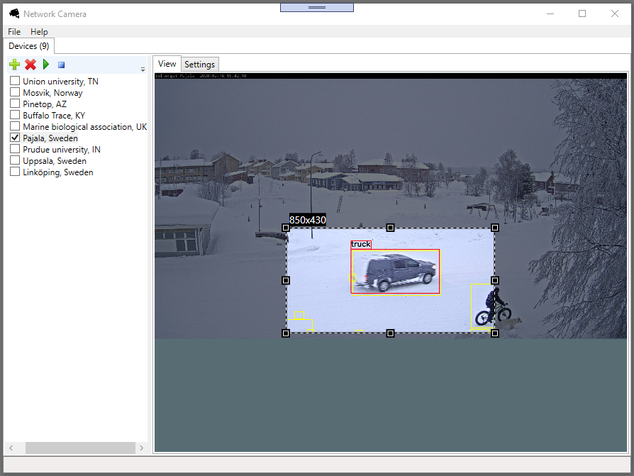
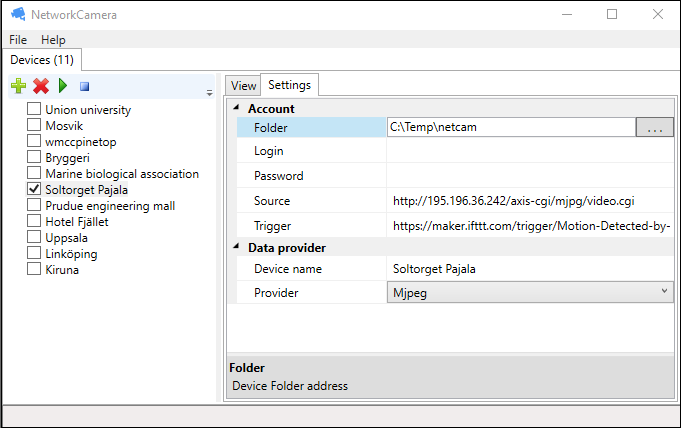

Network camera
=========

## Introduction ##
Windows desktop application for network cameras.

Built in motion detection to save images of motion to disk or send notification messages to services like [IFTTT](http://ifttt.com).

## Camera view with object detection ##

## Camera settings ##

## Contact ##
info@capnode.com
